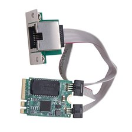
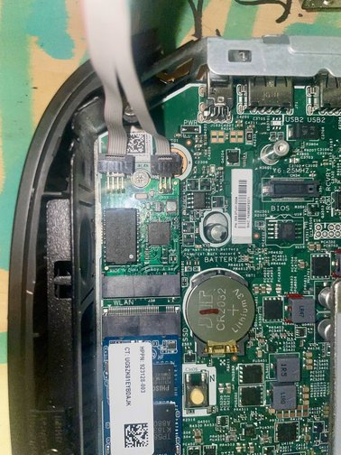
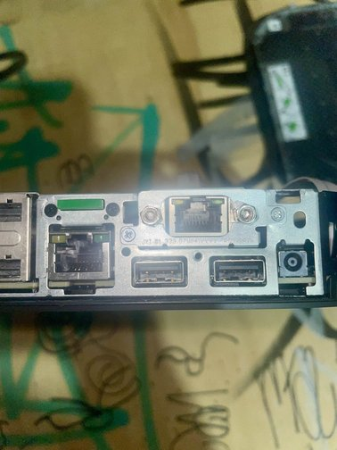
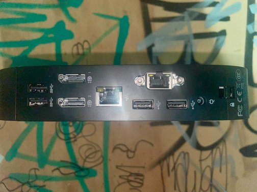

I have recently come across a few HP t530 Thin Clients. Originally, I was just looking for a single cheap x86 device for a router build, but I ended up with far more than I needed, with the intention of using them for other projects.

The first use was as an OPNsense router. Previously, on my home network, I was port forwarding and controlling my network using Virgin Media’s Hub 5 web UI, and I’m sure you can guess, it was terrible.

My main issue was that I couldn’t reliably port forward. Well, technically, I could, but the settings would reset back to default after about an hour. This seems to be a long‑standing problem with Virgin Media’s Hub 5 web interface, but I guess they don’t bother fixing it since only about 0.01% of people ever use it (that’s just an estimate).

Moving on to the actual build, the HP t530 has a big limitation when it comes to acting as a low‑power router: it only has one Ethernet port.

This is a problem, because for an OPNsense router to function properly, you need both an input and an output network interface. In theory, OPNsense could run on a single‑NIC system, but that would require Wi‑Fi capability or VLAN setup, which isn’t ideal for my use case.

I knew about this issue before buying them, and I had actually come across this article on ParkyTowers that detailed a clever hardware solution:

[ParkyTowers HP t530 Mods Page](https://www.parkytowers.me.uk/thin/hp/t530/mods.shtml)

They solved the single‑port issue by installing a Realtek 2.5 Gb NIC adapter in the M.2 slot originally intended for Wi‑Fi.

The installation went smoothly. You do need to install drivers for the new NIC adapter, but that just takes a USB stick and about half an hour of figuring out which driver is the correct one.

This thin client has been opened a few times already, as I’ve been swapping drives around.

Unfortunately, you do lose the VGA port once this modification is done. Since I shouldn’t ever need to plug a monitor into it and everything is managed through the web UI and SSH, this isn’t really a problem.

I might try writing a full guide in the future for installing and configuring OPNsense, but personal setups can vary a lot, so it’s not the easiest thing to make universal.

### Resources

- [OPNsense Official Documentation](https://docs.opnsense.org/)
- [ParkyTowers HP t530 Mods Page](https://www.parkytowers.me.uk/thin/hp/t530/mods.shtml)
- [Install OPNsense on x86 Hardware — Lawrence Systems (YouTube)](https://www.youtube.com/watch?v=tveq1zJtiGA)
- [OPNsense Networking and Interfaces Guide](https://docs.opnsense.org/manual/interfaces.html)
- [r/OPNsense on Reddit](https://www.reddit.com/r/OPNsense/)
