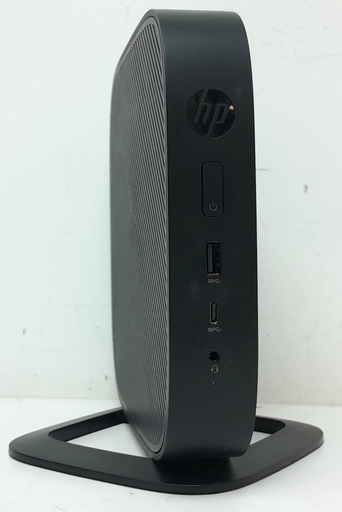
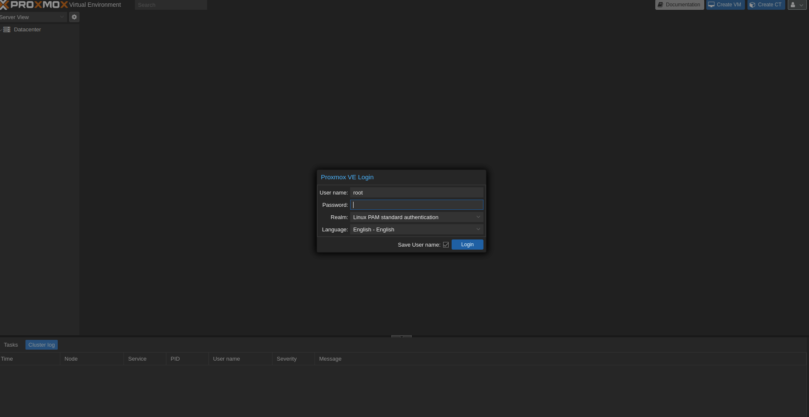
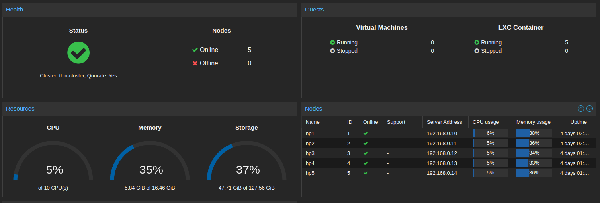
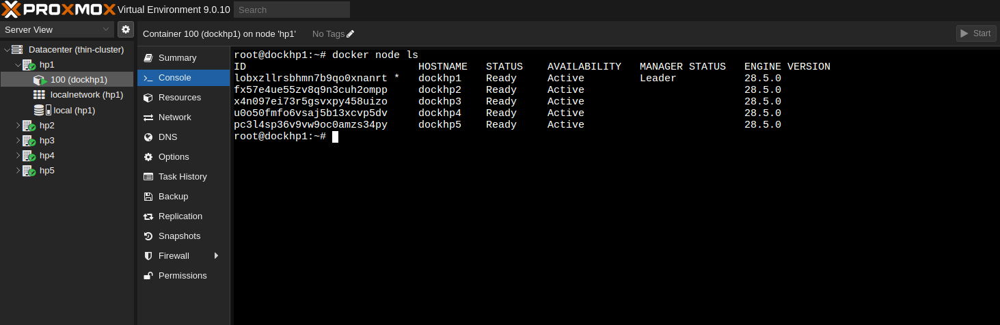
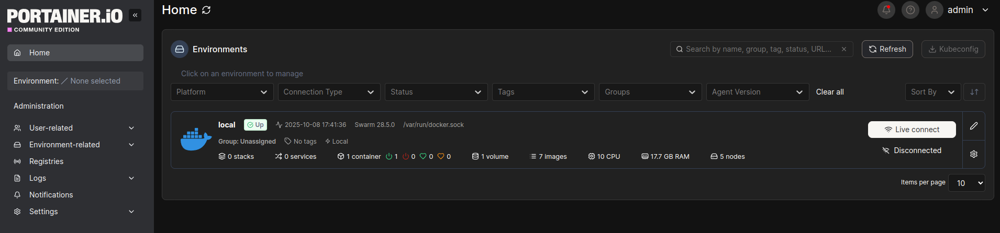
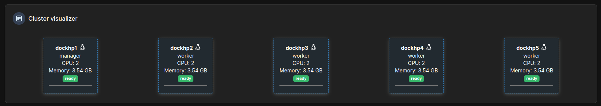
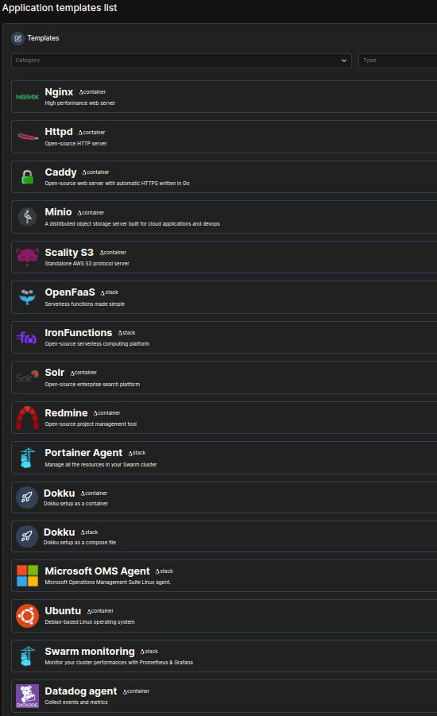

My original intention for this build was to host this very site on it, as at the time I was without one. This eventually evolved into me hosting my media collection for friends and family, as there are some brilliant ways to do so through Jellyfin. I currently have a media server that runs a stack of Jellyfin + Radarr + Sonarr and various other "Arrs", but that just runs on an old laptop. It will likely be migrated to this cluster since the ability to host different apps on different nodes is far superior to having them all crammed into an i3 laptop with an external SSD.

I may do a write up on that stack after I re implement it, as I’ve been looking into a few Docker Compose files that offer a full stack deployment of the services I want.

When starting this build, I knew I wanted to use thin clients, relatively cheap, easy to modify, and x86 based, so they can run just about anything. After shopping around for a while, I managed to pick up way more of them than I needed, 27 to be exact. Half were resold to recoup my money, and the rest, well, you know how projects go.

The thin clients I went with are HP t530s, and after working with them, I really like them, brilliant if you want "bang for your buck!"

 

###A note on Raspberry Pi:

There’s a wealth of information out there about these tiny computers and some fantastic resources for setting up Proxmox clusters on them. One of my main issues with the Raspberry Pi, however, is price. While they’re still relatively affordable for what they do, they currently cost around £50 (for the 4 GB model at the time of writing). So £50 × 5 nodes is not exactly trivial, especially when you consider that my current thin client nodes cost around £7 each.

 

These thin clients are very capable machines, and it’s a shame that most are seen as e waste these days. Going with thin clients is a great alternative for anyone building a cluster on a budget.

I wasn’t fond of the HP t530’s look initially, but they’ve grown on me after seeing a web of Ethernet cables explode out of the back of a stack of five of them. The cooling in a stack of five was also a lot better than expected.

All of the t530s came with a base, so you can have them standing upright.

Like this, they look a bit like some ugly router. (I even use one as my main router!)

 

###Specs per Node:

- AMD GX‑215JJ dual‑core @ 2.0 GHz
- 4 GB DDR4 RAM
- 32 GB M.2 SATA SSD

All of them came with Windows 10 Enterprise installed. The first step was to install Proxmox VE on each device.

It felt a bit tedious after the first one, but it went quicker than expected. The main thing that helped was assigning static IPs to each thin client before starting, since you can configure them during VE installation.

You can choose between CLI and GUI when installing Proxmox VE. I went with the GUI, it’s intuitive and straightforward, which really pays off when you’re doing it five times in a row.

After completing the first node, I checked that the web interface was running, it was, so I proceeded to install the next four. That allowed me to configure all five at once instead of adding nodes one by one.

This isn’t a full guide, so I’ll skip the detailed steps for joining nodes to a cluster. I will, however, link a few guides and resources at the end that I found helpful when setting this up. Every environment differs slightly, so it’s best to adapt as needed.

Before long, I had a working Proxmox cluster up and running.

I’ve seen there’s a way to automate cluster setup using Ansible, but I avoided it, mainly because it would consume valuable disk space, and local storage is already limited.

Storage space isn’t a major issue though, as I plan to add a NAS node to this cluster instead of using Ceph. I prefer a dedicated NAS for storing media so everything can be accessed from one convenient place. (There’ll be a write up on this soon.)

When it came to setting up Docker, the available tools and community resources made it straightforward. It feels quite similar to configuring the Proxmox cluster, except Docker Swarm organizes around a manager node that all other nodes connect to.

One of my main goals for this build is that it serves as an educational test bed. The first container I deployed via Docker Compose was Portainer, which gave me access to a huge range of preconfigured Docker templates. It’s a lot easier to deploy applications this way than through the CLI.

Just a few of the application deployments Portainer includes.

Next, I’ll be experimenting with the swarm to see its capabilities. I might migrate some of my current VPS services over, small web tools, monitoring stacks, or internal APIs for example.

The cluster or swarm will also get a sixth node dedicated to the NAS, as mentioned. I’m planning to use a fairly large Docker Compose setup for my Jellyfin stack when that happens.

 

Overall, this project has been fun and highly educational. Seeing how Docker Swarms and Proxmox clusters come together and operate as a distributed system has taught me a lot about service deployment and scaling. I also think clusters and swarms will become increasingly relevant in the growing AI and containerization landscape.

  

## Resources and Guides

Proxmox

- [Proxmox Official Documentation](https://pve.proxmox.com/wiki/Main_Page)
- [Creating a Proxmox VE Cluster](https://pve.proxmox.com/wiki/Cluster_Manager)
- [Proxmox VE Install Guide (Official Wiki)](https://pve.proxmox.com/wiki/Install_Proxmox_VE_on_Debian)

Docker & Swarm

- [Docker Swarm Overview (Docker Docs)](https://docs.docker.com/engine/swarm/)
- [Set Up a Docker Swarm Cluster](https://docs.docker.com/engine/swarm/swarm-tutorial/)
- [Portainer Official Website](https://www.portainer.io/)
- [Docker Compose Documentation](https://docs.docker.com/compose/)

Automation / Scripting

- [Automating Proxmox With Ansible](https://github.com/lae/ansible-role-proxmox)
- [Ansible Collections for Proxmox (GitHub)](https://github.com/ansible-collections/community.general)

Thin Clients & Hardware Reuse

- [HP t530 Thin Client Specification Sheet](https://support.hp.com/us-en/document/c05578560)
- [r/homelab Subreddit (great for small form builds and cluster discussions)](https://www.reddit.com/r/homelab/)
- [Thin Clients as Proxmox Nodes (ServeTheHome Thread)](https://forums.servethehome.com/index.php?threads/proxmox-on-hp-t530-thin-clients.29303/)
